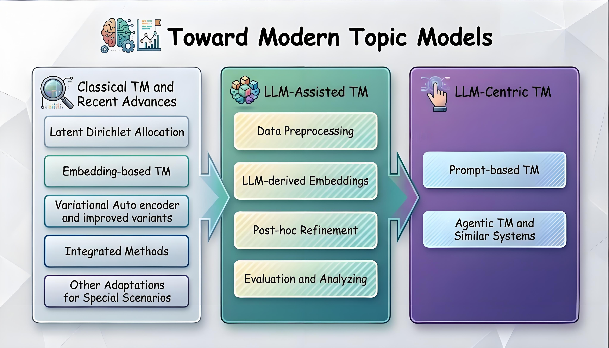

# Towards-Modern-Topic-Models

A curated list of papers and resources based on our survey paper **"Topic Models Towards the Modern: A Comprehensive Survey of Topic Models in the Era of Large Language Models"**, which is published at ACL 2026 Findings.

The template is adapted from [Awesome-Language-Model-on-Graphs](https://github.com/PeterGriffinJin/Awesome-Language-Model-on-Graphs).

## Introduction

LLMs have become foundational across many NLP applications, driving a shift from an algorithm‑centric to a context‑centric paradigm. As an important task in text mining, the landscape of topic modeling (TM) is similarly being reshaped by a growing body of LLM-driven research.

From the perspective of LLM involvement, we review recent TM developments and categorize existing methods into three groups: Classical, LLM‑Assisted, and LLM‑Centric.

For Classical methods, we refine prior taxonomies and highlight recent advances. For the LLM‑Assisted and LLM‑Centric settings, we introduce a new taxonomy that emphasizes the role of LLMs and the design of end-to-end workflows, respectively.

We further discuss how the TM paradigm may evolve—spanning task boundaries, input choices, and distributional definitions—and outline key challenges and prospective future directions. We hope this survey catalyzes deeper integration between TM and LLMs—advancing topic modeling that is easier to use, more powerful, and more flexible.

## Contents

- [Towards-Modern-Topic-Models](#towards-modern-topic-models)
  - [Introduction](#introduction)
  - [Contents](#contents)
  - [Classical Topic Models](#classical-topic-models)
    - [Latent Dirichlet Allocation (LDA)](#latent-dirichlet-allocation-lda)
    - [Embedding-based Topic Models](#embedding-based-topic-models)
      - [Static Word Embeddings](#static-word-embeddings)
      - [LLM-based Contextual Embeddings](#llm-based-contextual-embeddings)
      - [Other Embeddings](#other-embeddings)
    - [Variational Autoencoder (VAE) Based Models](#variational-autoencoder-vae-based-models)
      - [Foundation](#foundation)
      - [Prior Distribution](#prior-distribution)
      - [Contrastive Learning](#contrastive-learning)
      - [Optimal Transport](#optimal-transport)
    - [Integrated Methods](#integrated-methods)
    - [Special Scenarios Adaptations](#special-scenarios-adaptations)
      - [Short Text](#short-text)
      - [Dynamic Corpora](#dynamic-corpora)
      - [Hierarchical Topics](#hierarchical-topics)
      - [Cross-Application](#cross-application)
  - [LLM-Assisted Topic Models](#llm-assisted-topic-models)
    - [Data Preprocessing](#data-preprocessing)
    - [LLM-derived Embeddings](#llm-derived-embeddings)
    - [Post-hoc Refinement](#post-hoc-refinement)
    - [Evaluation and Analysis](#evaluation-and-analysis)
  - [LLM-Centric Topic Models](#llm-centric-topic-models)
    - [Level 1: Prompt-based Topic Modeling](#level-1-prompt-based-topic-modeling)
      - [One-Round LLM-Centric Topic Models](#one-round-llm-centric-topic-models)
      - [Two-Round LLM-Centric Topic Models](#two-round-llm-centric-topic-models)
    - [Level 2: Agentic Topic Modeling and Similar Systems](#level-2-agentic-topic-modeling-and-similar-systems)
      - [Multi-Agent and RAG-based Systems](#multi-agent-and-rag-based-systems)
  - [Datasets and Benchmarks](#datasets-and-benchmarks)
  - [Evaluation Metrics](#evaluation-metrics)
    - [Coherence Metrics](#coherence-metrics)
    - [Diversity Metrics](#diversity-metrics)
    - [Quality Metrics](#quality-metrics)
    - [LLM-based Metrics](#llm-based-metrics)
  - [Tools and Libraries](#tools-and-libraries)
    - [Classical Topic Modeling](#classical-topic-modeling)
    - [Neural Topic Modeling](#neural-topic-modeling)
    - [LLM-based Topic Modeling](#llm-based-topic-modeling)
  - [Contribution](#contribution)

## Classical Topic Models

### Latent Dirichlet Allocation (LDA)

1. **Latent Dirichlet Allocation** `JMLR 2003`

   *David M. Blei, Andrew Y. Ng, Michael I. Jordan* [[PDF](https://www.jmlr.org/papers/volume3/blei03a/blei03a.pdf)]

2. **Finding scientific topics** `PNAS 2004`

   *Thomas L. Griffiths, Mark Steyvers* [[PDF](https://www.pnas.org/doi/10.1073/pnas.0307752101)]

3. **LDA: A Robust and Large-scale Topic Modeling System** `VLDB 2017`

   *Lele Yu,Ce Zhang,Yingxia Shao,Bin Cui* [[PDF](https://www.vldb.org/pvldb/vol10/p1406-yu.pdf)]

4. **Hierarchical Latent Dirichlet Allocation for Large-Scale Data** `VLDB 2018`

   *Jianfei Chen, Jun Zhu, Jie Lu, Shixia Liu* [[PDF](https://doi.org/10.14778/3192965.3192972)]

### Embedding-based Topic Models

#### Static Word Embeddings

1. **Efficient Estimation of Word Representations in Vector Space** `ICLR 2013`

   *Tomas Mikolov, Kai Chen, Greg Corrado, Jeffrey Dean* [[PDF](https://arxiv.org/abs/1301.3781)]

2. **GloVe: Global Vectors for Word Representation** `EMNLP 2014`

   *Jeffrey Pennington, Richard Socher, Christopher Manning* [[PDF](https://aclanthology.org/D14-1162/)]

3. **Topic Modeling in Embedding Spaces** `TACL 2020`

   *Adji B. Dieng, Francisco J. R. Ruiz, David M. Blei* [[PDF](https://aclanthology.org/2020.tacl-1.29/)] [[Code](https://github.com/adjidieng/ETM)]

4. **Tired of Topic Models? Clusters of Pretrained Word Embeddings Make for Fast and Good Topics too!** `EMNLP 2020`

   *Suzanna Sia, Ayush Dalmia, Sabrina J. Mielke* [[PDF](https://aclanthology.org/2020.emnlp-main.135/)]

5. **EmTM: Embedding-based Topic Model** `WWW 2023`

   *Junaid Rashid, Jungeun Kim,Usman Naseem* [[PDF](https://dl.acm.org/doi/10.1145/3543873.3587316)]

6. **Representing Mixtures of Word Embeddings with Mixtures of Topic Embeddings** `ICLR 2022`

   *Dongsheng Wang, Dandan Guo, He Zhao, Huangjie Zheng, Korawat Tanwisuth, Bo Chen, Mingyuan Zhou* [[PDF](https://arxiv.org/abs/2203.01570)]

#### LLM-based Contextual Embeddings

1. **BERT: Pre-training of Deep Bidirectional Transformers for Language Understanding** `NAACL 2019`

   *Jacob Devlin, Ming-Wei Chang, Kenton Lee, Kristina Toutanova* [[PDF](https://aclanthology.org/N19-1423/)] [[Code](https://github.com/google-research/bert)]

2. **BERTopic: Neural Topic Modeling with a Class-based TF-IDF Procedure** `arXiv 2022`

   *Maarten Grootendorst* [[PDF](https://arxiv.org/abs/2203.05794)] [[Code](https://github.com/MaartenGr/BERTopic)]

3. **DeTiME: Diffusion-Enhanced Topic Modeling using Encoder-Decoder Based LLM** `EMNLP 2023`

   *Weijie Xu, Wenxiang Hu, Fanyou Wu, Srinivasan H. Sengamedu* [[PDF](https://aclanthology.org/2023.findings-emnlp.606.pdf)]

4. **FASTopic: A Fast, Adaptive, Stable, and Transferable Topic Modeling Paradigm** `NeurIPS 2024`

   *Xiaobao Wu, Thong Nguyen, Delvin Ce Zhang, William Yang Wang, Anh Tuan Luu* [[PDF](https://www.proceedings.com/content/079/079017-2683open.pdf)] [[Code](https://github.com/bobxwu/FASTopic)]

5. **Topic Modeling with Contextualized Embeddings** `ACL 2024`

   *Letian Peng, Yuwei Zhang, Jingbo Shang* [[PDF](https://aclanthology.org/2024.findings-acl.1/)]

6. **MTM: Multi-view Topic Modeling with Contextual Embeddings** `WWW 2025`

   *Abilasha S, Rafika Boutalbi, Stéphane Delliaux* [[PDF](https://dl.acm.org/doi/10.1145/3701716.3715563)]

#### Other Embeddings

1. **HyperMiner: Topic Taxonomy Mining with Hyperbolic Embedding** `NeurIPS 2022`

   *Yishi Xu, Dongsheng Wang, Bo Chen, Ruiying Lu, Zhibin Duan, Mingyuan Zhou* [[PDF](https://papers.nips.cc/paper_files/paper/2022/file/cd004fa45fc1fe5c0218b7801d98d036-Paper-Conference.pdf)]

2. **DiffETM: Diffusion Process Enhanced Embedded Topic Model** `ICASSP 2025`

   *Wei Shao, Mingyang Liu, Linqi Song* [[PDF](https://ieeexplore.ieee.org/stamp/stamp.jsp?tp=&arnumber=10888356)]

### Variational Autoencoder (VAE) Based Models

#### Foundation

1. **Autoencoding Variational Inference For Topic Models** `ICLR 2017`

   *Akash Srivastava, Charles Sutton* [[PDF](https://arxiv.org/abs/1703.01488)]

#### Prior Distribution

1. **Neural Topic Models with Nonlinear Structural Modeling** `ACL 2023`

   *HeGang Chen, Pengbo Mao, Yuyin Lu, Yanghui Rao* [[PDF](https://aclanthology.org/2023.acl-long.578/)]

2. **S2WTM: Spherical Sliced-Wasserstein Topic Model** `ACL 2025`

   *Suman Adhya, Debarshi Kumar Sanyal* [[PDF](https://aclanthology.org/2025.acl-long.1131/)]

#### Contrastive Learning

1. **Neural Topic Model with Adversarial Contrastive Learning** `ACL 2023`

   *Boyu Wang, Linhai Zhang, Deyu Zhou, Yi Cao, Jiandong Ding* [[PDF](https://aclanthology.org/2023.findings-acl.616/)]

2. **ContraTopic: Contrastive Learning for Neural Topic Models** `NeurIPS 2021`

   *Thong Nguyen, Anh Tuan Luu* [[PDF](https://arxiv.org/abs/2110.12764)]

3. **Topic Modeling as Multi-Objective Contrastive Optimization** `ICLR 2024`

   *Thong Nguyen, Xiaobao Wu, Xinshuai Dong, Cong-Duy T Nguyen, See-Kiong Ng, Anh Tuan Luu* [[PDF](https://arxiv.org/abs/2402.07577)]

#### Optimal Transport

1. **Neural Topic Model via Optimal Transport** `ICLR 2021`

   *He Zhao, Dinh Phung, Viet Huynh, Trung Le, Wray Buntine* [[PDF](https://arxiv.org/abs/2008.13537)]

2. **NeuroMax: Enhancing Neural Topic Models via Maximizing Mutual Information and Group Topic Regularization** `EMNLP 2024`

   *Duy-Tung Pham, Thien Trang Nguyen Vu, Tung Nguyen, Linh Ngo Van, Duc Anh Nguyen, Thien Huu Nguyen* [[PDF](https://aclanthology.org/2024.findings-emnlp.457.pdf)]

3. **TraCo: Hierarchical Neural Topic Modeling with Affinity, Rationality and Diversity** `AAAI 2024`

   *Xiaobao Wu, Fengjun Pan, Thong Nguyen, Yichao Feng, Chaoqun Liu, Cong-Duy Nguyen, Anh Tuan Luu* [[PDF](https://ojs.aaai.org/index.php/AAAI/article/view/29895)]

4. **EnCOT: Topic Modeling for Short Texts with Entropic Optimal Transport** `ACL 2025`

   *Tu Vu, Manh Do, Tung Nguyen, Linh Ngo Van, Sang Dinh, Thien Huu Nguyen* [[PDF](https://aclanthology.org/2025.findings-acl.398/)]

### Integrated Methods

1. **vONTSS: vMF based Semi-Supervised Neural Topic Modeling with Optimal Transport** `ACL 2023`

   *Weijie Xu, Xiaoyu Jiang, Srinivasan H. Sengamedu, Francis Iannacci, Jinjin Zhao* [[PDF](https://aclanthology.org/2023.findings-acl.271.pdf)]

2. **Deep Bayesian Network for Semantic-Aware Topic Modeling** `IEEE TKDE 2023`

   *Delvin Ce Zhang, Hady W.Lauw* [[PDF](https://ieeexplore.ieee.org/stamp/stamp.jsp?tp=&arnumber=10214042)]

3. **HiCOT: Hierarchical Contrastive Learning with Optimal Transport for Neural Topic Modeling** `ACL 2025`

   *Hoang Tran Vuong, Tue Le, Tu Vu, Tung Nguyen, Linh Ngo Van, Sang Dinh, Thien Huu Nguyen* [[PDF](https://aclanthology.org/2025.findings-acl.715/)]

### Special Scenarios Adaptations

#### Short Text

1. **kNNTM: k-Nearest-Neighbors Regularized Neural Topic Model** `ACL 2024`

   *Yang Lin, Xinyu Ma, Xin Gao, Ruiqing Li, Yasha Wang, Xu Chu* [[PDF](https://aclanthology.org/2024.findings-acl.817/)]

2. **Enhancing Short Text Topic Modeling with LLM-Driven Context Expansion and Prefix-Tuned VAEs** `EMNLP 2024`

   *Pritom Saha Akash, Kevin Chen-Chuan Chang* [[PDF](https://aclanthology.org/2024.findings-emnlp.917/)]

#### Dynamic Corpora

1. **Dynamic Semantic-based Neural Topic Model with Citation Network** `EMNLP 2023`

   *Nozomu Miyamoto, Masaru Isonuma, Sho Takase, Junichiro Mori, Ichiro Sakata* [[PDF](https://aclanthology.org/2023.findings-acl.366/)]

#### Hierarchical Topics

1. **NSEM-GMHTM: Nonlinear Structural Equation Modeling with Gaussian Mixture for Hierarchical Topic Modeling** `ACL 2023`

   *HeGang Chen, Pengbo Mao, Yuyin Lu, Yanghui Rao* [[PDF](https://aclanthology.org/2023.acl-long.578/)]

#### Cross-Application

1. **BERTDetect: Android Malware Detection with BERT-based Topic Modeling** `WWW 2025`

   *Nishavi Ranaweera, Jiarui Xu, Suranga Seneviratne, Aruna Seneviratne* [[PDF](https://dl.acm.org/doi/10.1145/3701716.3717501)]

2. **CTM-MM: Cross-modal Topic Model for Multimodal Social Media** `WWW 2023`

   *Junaid Rashid, Jungeun Kim, Usman Naseem* [[PDF](https://dl.acm.org/doi/10.1145/3543507.3587433)]

## LLM-Assisted Topic Models

### Data Preprocessing

1. **Enhancing Short Text Topic Modeling with LLM-Driven Context Expansion and Prefix-Tuned VAEs** `EMNLP 2024`

   *Pritom Saha Akash, Kevin Chen-Chuan Chang* [[PDF](https://aclanthology.org/2024.findings-emnlp.917/)]

2. **LimTopic: LLM-based Topic Modeling with Semantic Awareness** `JCDL 2024`

   *Ibrahim Al Azhar, Venkata Devesh Reddy, Hamed Alhoori, Akhil Pandey Akella* [[PDF](https://arxiv.org/abs/2503.10658)]

3. **LiSA: LLM-Guided Semantic-Aware Clustering for Topic Modeling** `ACL 2025`

   *Jianghan Liu, Ziyu Shang, Wenjun Ke, Peng Wang, Zhizhao Luo, Jiajun Liu, Guozheng Li, Yining Li* [[PDF](https://aclanthology.org/2025.acl-long.902/)]

### LLM-derived Embeddings

1. **DeTiME: Diffusion-Enhanced Topic Modeling using Encoder-Decoder Based LLM** `EMNLP 2023`

   *Weijie Xu, Wenxiang Hu, Fanyou Wu, Srinivasan H. Sengamedu* [[PDF](https://aclanthology.org/2023.findings-emnlp.606/)]

2. **DisCTM: Disentangled Contextualized Topic Model for Domain-Specific Short Texts** `WSDM 2025`

   *Rui Wang, Xing Liu, Yanan Wang, Shuyu Chang, Yuanzhi Yao, Haiping Huang* [[PDF](https://dl.acm.org/doi/10.1145/3701551.3703534)]

3. **FinBERT2: Financial Topic Modeling with Fine-tuned Embeddings** `KDD 2025`

   *Xuan Xu, Fufang Wen, Beilin Chu, Zhibing Fu, Qinhong Lin, Jiaqi Liu, Binjie Fei, Yu Li, Linna Zhou, Zhongliang Yang* [[PDF](https://dl.acm.org/doi/10.1145/3711896.3737219)]

### Post-hoc Refinement

1. **BERTopic: Neural Topic Modeling with a Class-based TF-IDF Procedure** `arXiv 2022`

   *Maarten Grootendorst* [[PDF](https://arxiv.org/abs/2203.05794)] [[Code](https://github.com/MaartenGr/BERTopic)]

2. **AgenTopic: Multi-Agent Framework for Scientific Literature Topic Analysis** 
 [[Code](https://github.com/pariskang/AgenTopic)]

3. **LLM-ITL: Neural Topic Modeling with LLM-based Optimal Transport Alignment**  [[Code](https://github.com/Xiaohao-Yang/LLM-ITL)]

### Evaluation and Analysis

1. **Revisiting Automated Topic Model Evaluation with Large Language Models** `EMNLP 2023`

   *Dominik Stammbach, Vilém Zouhar, Alexander Hoyle, Mrinmaya Sachan, Elliott Ash* [[PDF](https://aclanthology.org/2023.emnlp-main.581/)]

2. **WALM: LLM as Reading Tea Leaves for Topic Model Evaluation** `TACL 2025`

   *Xiaohao Yang, He Zhao, Dinh Phung, Wray Buntine, Lan Du* [[PDF](https://aclanthology.org/2025.tacl-1.17/)]

3. **FinBERT2: Financial Topic Modeling with Fine-tuned Embeddings** `KDD 2025`

   *Xuan Xu, Fufang Wen, Beilin Chu, Zhibing Fu, Qinhong Lin, Jiaqi Liu, Binjie Fei, Yu Li, Linna Zhou, Zhongliang Yang* [[PDF](https://dl.acm.org/doi/10.1145/3711896.3737219)]

4. **ProxAnn: Use-Oriented Evaluations of Topic Models with LLM Proxy Annotations** `ACL 2025`

   *Alexander Hoyle, Lorena Calvo-Bartolomé, Jordan Boyd-Graber, Philip Resnik* [[PDF](https://aclanthology.org/2025.acl-long.772/)]

5. **Large Language Models for Topic Discovery: Opportunities and Challenges** `arXiv 2025`

   *Xiaoran Liu, Ruixiao Li, Mianqiu Huang, Zhigeng Liu, Yuerong Song, Qipeng Guo, Siyang He, Qiqi Wang, Linlin Li, Qun Liu, Ziwei He, Yaqian Zhou, Xuanjing Huang, Xipeng Qiu* [[PDF](https://arxiv.org/abs/2502.17129)]

## LLM-Centric Topic Models

### Level 1: Prompt-based Topic Modeling

#### One-Round LLM-Centric Topic Models

1. **Vanilla Prompts for Topic Discovery** `LREC-COLING 2024`

   *Yida Mu, Chun Dong, Kalina Bontcheva, Xingyi Song* [[PDF](https://aclanthology.org/2024.lrec-main.887/)]

2. **Tailored Prompt Designs for Short Texts** `ACL 2024`

   *Tomoki Doi, Masaru Isonuma, Hitomi Yanaka*[[PDF](https://aclanthology.org/2024.acl-srw.3/)]

3. **One-Pass Topic Modeling** `arXiv 2024`

   *Kappei* [[PDF](https://medium.com/@kappei/a-novel-approach-to-topic-modeling-using-large-language-models-llms-648c131393d2)]

4. **Topic Modeling as Long-form Generation** `arXiv 2025`

   *Xuan Xu, Haolun Li, Zhongliang Yang, Beilin Chu, Jia Song, Moxuan Xu, Linna Zhou* [[PDF](https://arxiv.org/abs/2510.03174)]

#### Two-Round LLM-Centric Topic Models

1. **TopicGPT: Topic Modeling with LLM Generation and Classification** `NAACL 2024`

   *Chau Minh Pham, Alexander Hoyle  Simeng Sun, Philip Resnik, Mohit Iyyer* [[PDF](https://aclanthology.org/2024.naacl-long.164/)]

2. **TopicGen: Two-Stage Topic Discovery** `bnaic 2024`

   *Cascha van Wanrooij, Omendra Kumar Manhar, and Jie Yang* [[PDF](https://bnaic2024.sites.uu.nl/wp-content/uploads/sites/986/2024/10/Topic-Modeling-for-Small-Data-using-Generative-LLMs.pdf)]

3. **CHIME: LLM-Assisted Hierarchical Topic Modeling** `ACL 2024`

   *Chao-Chun Hsu, Erin Bransom, Jenna Sparks, Bailey Kuehl, Chenhao Tan, David Wadden, Lucy Lu Wang, Aakanksha Naik* [[PDF](https://aclanthology.org/2024.findings-acl.8/)]

### Level 2: Agentic Topic Modeling and Similar Systems

#### Multi-Agent and RAG-based Systems

1. **Coordinated multi-prompt or multi-agent workflows**[[Code](https://lilianweng.github.io/posts/2023-06-23-agent/)]

2. **Aella Explorer** [[Code](https://github.com/context-labs/aella-data-explorer)]

3. **BettaFish** [[Code](https://github.com/666ghj/BettaFish/tree/main)]

4. **automated survey pipelines** `arXiv 2025`
   
   *Xun Liang, Jiawei Yang, Yezhaohui Wang, Chen Tang, Zifan Zheng, Shichao Song, Zehao Lin, Yebin Yang, Simin Niu, Hanyu Wang, Bo Tang, Feiyu Xiong, Keming Mao, Zhiyu li*[[PDF](https://arxiv.org/abs/2502.14776)]

## Datasets and Benchmarks

1. **20 Newsgroups** - Classic benchmark for topic modeling

2. **Reuters-21578** - News article classification dataset

3. **AGNews** - News article dataset with 4 categories

4. **DBpedia** - Ontology classification dataset

5. **Yahoo! Answers** - Question-answer pairs dataset

6. **Yelp Reviews** - Restaurant review dataset

7. **IMDB Reviews** - Movie review dataset

8. **ArXiv Papers** - Scientific paper abstracts

9. **PubMed** - Biomedical literature abstracts

10. **Wikipedia** - Encyclopedia articles

## Evaluation Metrics

### Coherence Metrics

- **C_V**: Normalized pointwise mutual information
- **C_NPMI**: Normalized PMI coherence
- **C_UCI**: UCI coherence measure
- **C_UMass**: UMass coherence measure

### Diversity Metrics

- **Topic Diversity**: Percentage of unique words across topics
- **Inverted RBO**: Rank-biased overlap measure

### Quality Metrics

- **Perplexity**: Model's predictive performance
- **Topic Quality**: Combined coherence and diversity

### LLM-based Metrics

- **LLM Coherence**: LLM-judged topic coherence
- **LLM Informativeness**: LLM-judged topic informativeness
- **Human Correlation**: Correlation with human judgments

## Tools and Libraries

### Classical Topic Modeling

1. **Gensim** - Python library for topic modeling [[Code](https://github.com/RaRe-Technologies/gensim)]

2. **Scikit-learn** - Machine learning library with LDA [[Code](https://github.com/scikit-learn/scikit-learn)]

3. **MALLET** - Java-based topic modeling toolkit [[Link](http://mallet.cs.umass.edu/)]

### Neural Topic Modeling

1. **TopMost** - Neural topic modeling toolkit [[Code](https://github.com/bobxwu/topmost)]

2. **BERTopic** - BERT-based topic modeling [[Code](https://github.com/MaartenGr/BERTopic)]

3. **FASTopic** - Fast and adaptive topic modeling [[Code](https://github.com/bobxwu/FASTopic)]

4. **Contextualized Topic Models** - CTM implementation [[Code](https://github.com/MilaNLProc/contextualized-topic-models)]

### LLM-based Topic Modeling

1. **AgenTopic** - Multi-agent topic modeling framework [[Code](https://github.com/pariskang/AgenTopic)]

2. **LimTopic** - LLM-based topic modeling [[Code](https://github.com/bobxwu/LimTopic)]

## Contribution

We welcome contributions to this repository! If you have suggestions for papers, resources, or corrections, please:

1. Fork this repository
2. Create a new branch for your changes
3. Submit a pull request with a clear description

You can also open an issue to suggest additions or report errors.